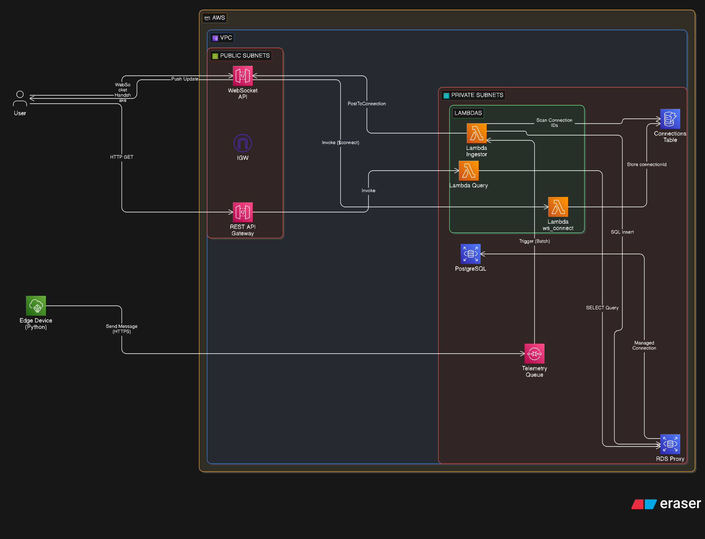

# 🏭 Industrial Telemetry Cloud

Sistema de telemetria industrial serverless na AWS, projetado para ingestão, processamento e armazenamento seguro de dados de máquinas e equipamentos industriais.

## 📋 Índice

- [Visão Geral](#-visão-geral)
- [Arquitetura](#-arquitetura)
- [Decisões de Arquitetura](#-decisões-de-arquitetura)
- [Fluxo de Dados](#-fluxo-de-dados)
- [Segurança e Redes](#-segurança-e-redes)
- [Análise de Custos (FinOps)](#-análise-de-custos-finops)
- [Resiliência e Testes (Poison Pill)](#-resiliência-e-testes-poison-pill)
- [Estrutura do Projeto](#-estrutura-do-projeto)
- [Deploy e CI/CD](#-deploy-e-cicd)

---

## 🎯 Visão Geral

Este projeto implementa uma arquitetura Cloud-Native para coleta e processamento de dados de telemetria industrial em tempo real, utilizando:

- **Infraestrutura como Código (IaC)** com Terraform.
- **Arquitetura 100% Serverless** com AWS Lambda e SQS.
- **Comunicação em Tempo Real** via WebSockets (API Gateway).
- **Banco de Dados Relacional Seguro** com Amazon RDS PostgreSQL e RDS Proxy.
- **Segurança Avançada** com VPC Endpoints e IAM Database Authentication.

---

## 🏗️ Arquitetura



---

## 💡 Decisões de Arquitetura

1. **VPC Totalmente Privada**: Para garantir o isolamento industrial, o backend (Lambdas e RDS) opera em sub-redes privadas sem acesso direto à internet pública.

2. **VPC Endpoints (PrivateLink)**: Substituem o uso de NAT Gateways para comunicação com SQS, DynamoDB e CloudWatch, mantendo o tráfego dentro da rede da AWS.

3. **RDS Proxy**: Gerencia o pool de conexões das Lambdas, evitando sobrecarga no PostgreSQL e reduzindo a latência de cold start.

4. **Zustand com Persistência de Stats**: O frontend gerencia métricas de Máxima e Mínima de forma persistente na janela de tempo, garantindo que picos de temperatura não sejam "esquecidos" quando saem da renderização do gráfico.

---

## 🔄 Fluxo de Dados

### 1. Ingestão e Processamento

- **Edge Device**: Script Python que envia payloads JSON para o SQS com lógica de retry.
- **Amazon SQS**: Atua como buffer resiliente para absorver picos de carga.
- **Lambda Ingestor**: Processa as mensagens, persiste no RDS e notifica clientes via WebSocket.

### 2. Visualização (Real-time & Histórico)

- **WebSockets**: Notificações instantâneas de novos dados para o dashboard.
- **REST API**: Consulta de dados históricos para preenchimento de gráficos e tabelas.

---

## 🔐 Segurança e Redes

### Topologia de Rede

O projeto adota uma postura de **Zero Trust** na rede interna:

- **Private Subnets**: Onde residem o RDS, RDS Proxy e as ENIs das Lambdas.
- **VPC Endpoints**: Interface para SQS, STS, Logs e Monitoring; Gateway para DynamoDB.
- **Sem Internet Gateway/NAT Gateway**: Redução drástica da superfície de ataque e de custos fixos.

---

## 💰 Análise de Custos (FinOps)

Uma das maiores otimizações deste projeto foi a substituição de NAT Gateways por VPC Endpoints:

- **Economia Estimada**: Um NAT Gateway custa aproximadamente **$32.00/mês** por zona (fixo). Ao usar VPC Endpoints, pagamos apenas pelos serviços utilizados, reduzindo o custo fixo de rede em até **80%** para ambientes de telemetria de médio porte.

---

## 🧪 Resiliência e Testes (Poison Pill)

Para validar a confiabilidade da Dead Letter Queue (DLQ), o sistema inclui uma lógica de **Poison Pill**:

- Se uma mensagem contendo `machine_id: "POISON_PILL_TEST"` for enviada, a Lambda forçará um erro proposital.
- Isso permite testar o fluxo de reprocessamento do SQS e a segregação automática de mensagens corrompidas para a DLQ para análise posterior.

---

## 📁 Estrutura do Projeto

```text
industrial-telemetry-cloud/
├── terraform/               # Infraestrutura como Código
│   ├── vpc.tf               # Rede Privada e Subnets
│   ├── vpc_endpoints.tf     # Configuração de PrivateLink
│   ├── rds.tf               # Banco de Dados e Proxy
│   ├── lambda.tf            # Definição das funções Serverless
│   └── sqs.tf               # Filas de Ingestão e DLQ
├── lambda/                  # Backend Python
│   ├── ingestor/            # Processamento de dados SQS -> RDS
│   │   └── lambda_handler.py
│   └── query/               # API REST e WebSocket
│       ├── get_telemetry.py
│       └── ws_connect.py
├── web/                     # Frontend React (Vite + TS)
│   └── src/
│       ├── store/           # Estado Global (Zustand)
│       └── components/      # UI Industrial
└── producer/                # Simulador de Dispositivo de Borda
    └── edge_device.py
```

---

## 🚀 Deploy e CI/CD

### Automação com GitHub Actions

O projeto utiliza CI/CD para garantir deploys padronizados:

- **Lint & Format**: Validação de código Terraform e Python.
- **Terraform Plan**: Visualização de mudanças na infraestrutura em cada Pull Request.
- **Auto-Deploy**: Aplicação automática na branch main.

### Execução Local (LocalStack)

O projeto é 100% testável localmente utilizando LocalStack Pro:

```bash
docker-compose up -d
./deploy.sh
```

---

## 👤 Autor

**Thiago Gritti** - [LinkedIn](https://linkedin.com/in/thiago-gritti)
